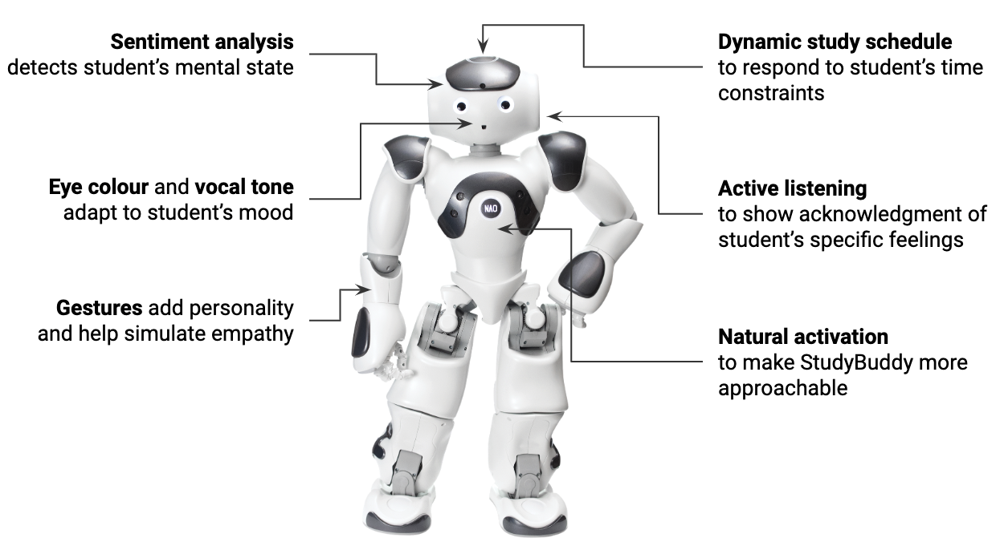

# Study Buddy

## Abstract
Test anxiety affects many students and prevents them from achieving results fitting of their abilities. This project addressed the problem of student test anxiety by providing a robot study companion. The StudyBuddy supports students by providing empathy and by assisting them in scheduling their revision time. 
The *StudyBuddy* utilises sentiment analysis to assess the student’s anxiety levels and respond accordingly. This is combined with extensive DialogFlow infrastructure to enhance conversational ability. A major strength of the design is the dynamic scheduling module that generates a full study timetable based on the student’s time constraints. “Active standby” along with responsive gestures, eye colour, and vocal tone help enhance the usability of StudyBuddy, whilst affording hints of a personality. 
Through the user-centred design process, *StudyBuddy* was refined into a working prototype that was evaluated in a pilot study (7 participants, 17 tests). Both qualitative and quantitative methods were used to evaluate the prototype for robustness and its effect on the emotional state of the study participants. The robot was found to accurately evaluate participants’ anxiety levels and had a net positive impact on their emotional states. The study highlighted how the design could be improved through expanded DialogFlow datasets and more-nuanced sentiment analysis. These preliminary findings suggest that with further development *StudyBuddy* could be a useful tool to help anxious students. 

## The Team
- [gianlucatruda](http://github.com/gianlucatruda)
- [britt0508](http://github.com/britt0508)
- [sa-and](http://github.com/sa-and)
- [GiuBarrios](http://github.com/GiuBarrios)
- [nellylojewsky](http://github.com/nellylojewsky)
- [Serafim129](http://github.com/Serafim179)

---

## Development Workflow

We only have limited access to the Nao hardware. We will develop as follows:
1. Divide the project up into features and write [tasks](https://github.com/gianlucatruda/sir2019-study-buddy-group-7/issues) for each feature. Don't forget to check who is assigned to each issue/task.
2. Branch from the base branch (called `dev`) into a branch for your feature. By convention, you name the branch something like `12-wave-hello`, where `12` is the number of the issue and `wave-hello` is a brief description of the feature.
3. Develop and **commit** onto your feature branch (e.g. `12-wave-hello`). You should **push** these commits to Github frequently.
4. When your feature is complete and you're pretty confident it will work (and is tidy), **push** and then submit a [pull request](https://github.com/gianlucatruda/sir2019-study-buddy-group-7/pulls) to the `dev` branch.
5. Assign someone else to review your [pull request](https://github.com/gianlucatruda/sir2019-study-buddy-group-7/pulls).
6. If they have concerns, they will review your pull request and request changes. Make these changes on your branch (e.g. `12-wave-hello`), **commit** them, and then **push** to that branch. The pull request (PR) will reflect this automatically when you **push** to your feature branch.
7. When the reviewer of your pull request (PR) is happy with your changes, they will approve your PR. You can then **merge** the PR to the `dev` branch. If you can't merge because of conflicts, don't panic. Ask someone who knows how to resolve merge conflicts for help.
8. When we are ready to test our latest functionality, we will test the `dev` branch on the Nao hardware. When we are happy with the latest batch of features, we will merge `dev` to `master` (using a PR). 
9. Everytime we have working code that implements some features and is stable, we should create a [release](https://github.com/gianlucatruda/sir2019-study-buddy-group-7/releases).
10. Go forth and write code! 🤓

---

